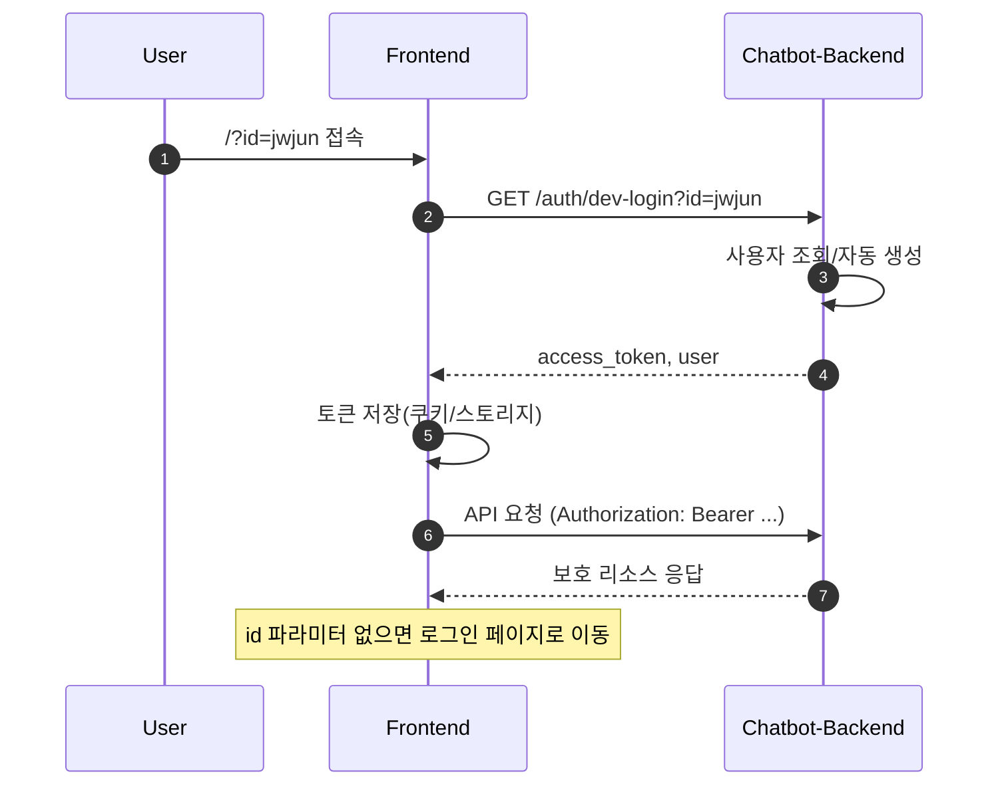

# 로그인 방식 제안서 (PoC 임시 인증 유지)

## 배경
- 제품화 목표로 `chatbot-backend`를 통한 인증 체계를 구축해야 함
- 고객사 인증 설계가 미완료 상태
- PoC에서는 `http://202.20.84.65:10000/?id=jwjun` 형태로 id를 전달하면 즉시 로그인 처리
- PoC 수준의 간편 로그인 기능을 유지해야 함

## 목표
- PoC 간편 로그인 방식을 보존하되, 보안 위험을 최소화
- 향후 정식 인증 체계로 전환 시 영향 최소화

## 제안 요약
- 임시 로그인 엔드포인트를 `chatbot-backend`에 제공
- `id` 파라미터로 유저를 식별하고, 백엔드에서 임시 세션/JWT 발급
- 프론트는 해당 토큰을 저장하고 이후 API 요청에 사용
- 운영/개발 환경에서만 허용되도록 제한

## 상세 제안

### 1) 임시 로그인 엔드포인트 설계
- `GET /auth/dev-login?id={user_id}`
- 동작:
  - `user_id` 존재 시 사용자 조회 또는 자동 생성
  - 서버에서 임시 토큰(JWT) 발급
  - 응답 예시:
    ```json
    {
      "user": {"id": "jwjun", "name": "jwjun"},
      "access_token": "<jwt>",
      "expires_in": 3600
    }
    ```

### 2) 접근 제한
- 환경변수로 활성화 제어
  - 예: `ENABLE_DEV_LOGIN=true`일 때만 동작
- 허용 IP 화이트리스트 적용 가능
  - 사내망 또는 특정 테스트망만 허용
- 로그 기록(누가 언제 로그인했는지)

### 3) 프론트 처리
- 기존 PoC URL 호환 유지
  - `/?id=jwjun` 형태로 접근 시 `dev-login` 호출
- 토큰 저장 위치
  - `localStorage` 또는 `cookie (httpOnly 권장)`
- 이후 요청은 Authorization 헤더에 토큰 포함

### 4) 정식 인증 전환 대비
- `dev-login`은 분리된 모드로 유지
- 정식 인증 도입 시
  - `dev-login` 비활성화
  - 프론트는 로그인 플로우를 교체하되 토큰 기반 구조는 유지

## 보안 리스크 및 완화
- 리스크: 임의의 `id`로 로그인 가능
- 완화:
  - 개발/스테이징 환경에서만 허용
  - IP 제한
  - 만료가 짧은 토큰 사용
  - 감사 로그 저장

## 필요한 결정 사항
1) dev-login 허용 환경(DEV/QA/POC만 허용 여부)
2) 토큰 저장 방식(쿠키 vs 로컬스토리지)
3) 사용자 자동 생성 정책(자동 생성 vs 사전 등록)

## JWT 정책(초안)
- 토큰 타입: Access Token 단일 사용 (PoC 단계)
- 만료: 30~60분 권장 (짧은 만료로 리스크 완화)
- 클레임 예시
  - `sub`: 사용자 ID
  - `name`: 사용자 이름
  - `role`: 사용자 역할(예: user, admin)
  - `iat`, `exp`: 발급/만료 시간
- 서명: HMAC(S256) 또는 RSA(RS256) (백엔드 표준에 맞춤)

## 프론트 로그인/세션 저장 흐름(요약)
1) 사용자가 `/?id=jwjun` 형태로 접속
2) 프론트가 `GET /auth/dev-login?id=jwjun` 호출
3) 응답 토큰 저장(쿠키 또는 로컬스토리지)
4) 이후 API 요청에 Authorization 헤더 포함
5) 토큰 만료 시 재로그인 유도 또는 자동 재요청
6) `id` 파라미터 없이 접근 시 로그인 페이지로 이동

## 시퀀스 다이어그램 (Mermaid)

