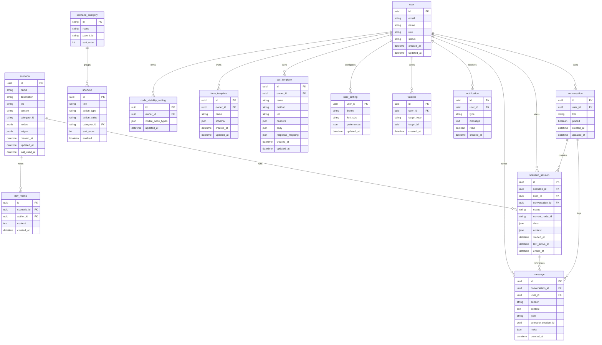

# ERD 초안 (제품화용)

## 개요
현재 PoC 기능과 고객사 요구사항을 기준으로 도출한 ERD 초안이다. 실제 테이블/컬럼은 백엔드 설계 확정 시 조정 필요.

## Mermaid ERD

## 모델 설명 요약
- `CONVERSATION`: LLM/일반 대화 목록(대화방)
- `MESSAGE`: LLM 포함 전체 대화 메시지 로그 (scenario_session_id는 선택)
- `SCENARIO`: 그래프 정의 (nodes/edges를 jsonb 배열로 저장)
- `SCENARIO_SESSION`: 실행 상태, 슬롯/컨텍스트 저장 (서버 권한 소스)
- `SCENARIO_CATEGORY/SHORTCUT`: 시나리오 시작/메뉴 구조
- `API_TEMPLATE/FORM_TEMPLATE`: 관리자 템플릿 관리
- `NOTIFICATION/FAVORITE/USER_SETTING`: 사용자 편의 기능
- `DEV_MEMO/NODE_VISIBILITY_SETTING`: 관리자/개발 보조 기능

## 남은 결정 사항
- 세션/메시지 보관 기간 및 파티셔닝 정책
- 슬롯/컨텍스트 JSON 스키마 고정 여부
- 멀티 테넌트(tenant) 분리 방식
- 역할/권한 모델(관리자/운영자/사용자)
