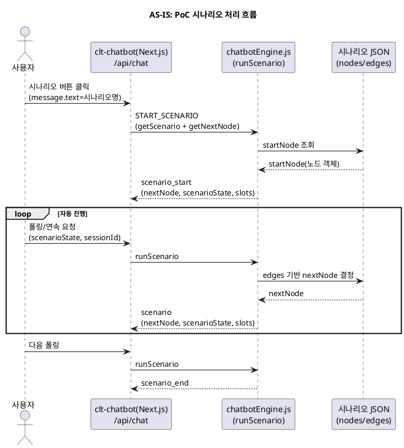
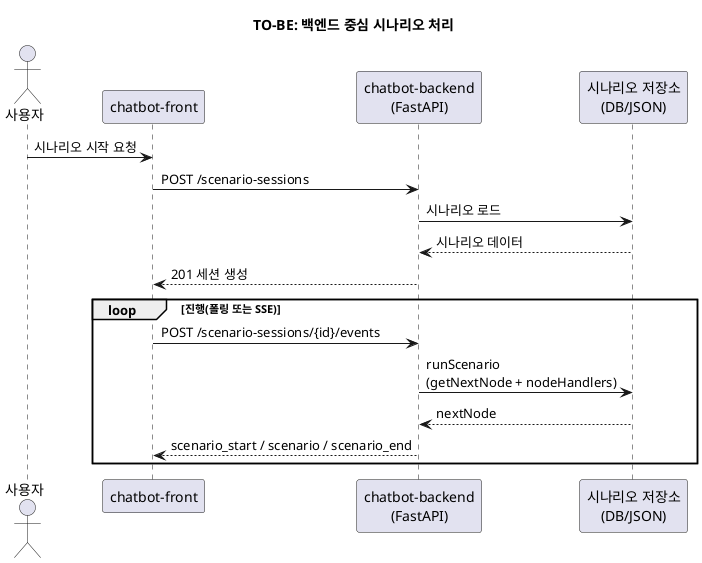
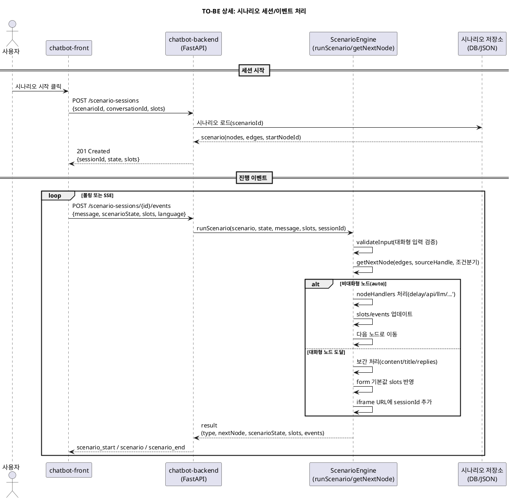

# 시나리오 처리 구현방안(통합 정리)

## 1) 목적/범위
- PoC 호환을 유지하면서 **백엔드(FastAPI) 중심으로 시나리오 세션/이벤트 처리**를 구현한다.
- 프론트는 PoC 응답 포맷을 우선 지원하고, 이후 정식 스펙(snake_case)로 전환한다.

## 2) 근거 자료 요약
- PoC 캡처: `reference/scenario_start_req_res.md`
  - 응답은 `type: scenario_start | scenario | scenario_end` + `nextNode` + `scenarioState` + `slots`
- 실제 시나리오 데이터: `tmp/DEV_1000_7.json`
  - `nextNode`는 `nodes[]` 항목 그대로 반환된 형태
- 참고 구현(프론트 PoC):
  - `reference/clt-chatbot/app/api/chat/route.js`
  - `reference/clt-chatbot/app/lib/chatbotEngine.js`
  - `reference/clt-chatbot/app/lib/nodeHandlers.js`
- 기존 산출물:
  - `00.documents/analysis/scenario-nextnode-mapping.md`
  - `00.documents/plan/scenario-processing-plan.md`

## 3) 핵심 관찰(정리)
- PoC에서 `nextNode`는 **시나리오 JSON의 node 객체를 그대로 반환**한다.
- `scenarioState`는 `{ scenarioId, currentNodeId, awaitingInput }` 형태로 유지된다.
- `awaitingInput`은 **대화형 노드**(form, slotfilling, branch(button))에서 true가 된다.
- 자동 진행 노드(delay/api/llm 등)는 서버가 연속 처리하여 다음 대화형 노드에서 멈춘다.

## 3-1) AS-IS 흐름(PlantUML)

## 3-2) TO-BE 흐름(PlantUML)

## 3-3) TO-BE 상세 시퀀스(PlantUML)

## 4) 구현 방향(권장)
### 4-1. PoC 호환 우선
- **PoC 응답 포맷 유지** (camelCase)
- 클라이언트 동작 확인 후 정식 스펙(snake_case)로 전환

### 4-2. 처리 주체
- **백엔드가 시나리오 진행 로직 담당**
  - 프론트는 단순 입력/폴링 역할

### 4-3. nextNode 구성
- DB 저장된 노드 객체를 그대로 반환
- 가공은 최소화
  1) 텍스트 보간
  2) form 기본값 슬롯 반영
  3) iframe 세션 파라미터 자동 부착

## 5) 구체 구현안
### 5-1. 시나리오 조회
- `GET /scenarios` : 목록
- `GET /scenarios/{id}` : 시나리오 JSON 반환

### 5-2. 시나리오 세션
- `POST /scenario-sessions`
  - 입력: `scenarioId`, `conversationId`, `slots`
  - 응답: 세션 생성 + 상태
- `GET /scenario-sessions/{id}`
  - 세션 상태 조회
- `PATCH /scenario-sessions/{id}`
  - 상태/슬롯 업데이트

### 5-3. 시나리오 진행 이벤트
- `POST /scenario-sessions/{id}/events`
  - 입력: `message`, `scenarioState`, `slots`, `language`, `scenarioSessionId`
  - 응답: PoC 호환 이벤트

#### 이벤트 응답 유형
- `scenario_start`
  - 시작 노드 반환
- `scenario`
  - 자동 진행 후 다음 대화형 노드 반환
- `scenario_end`
  - 시나리오 종료

## 6) 내부 처리 로직(백엔드)
### 6-1. getNextNode()
- `edges` + `sourceHandle` 기반으로 다음 노드 결정
- 조건 분기(branch) 지원
- startNodeId 우선, 없으면 incoming edge 없는 노드

### 6-2. runScenario()
- currentNode가 대화형이면 `awaitingInput=true`
- 비대화형 노드는 자동 처리 후 다음 노드로 이동
- 완료 시 `scenario_end`

### 6-3. nodeHandlers
- `message`, `form`, `branch`, `delay`, `api`, `llm` 처리
- API 노드 실패 시 slots에 `apiFailed` 플래그
- iframe 노드 처리 시 `scenario_session_id` 추가

## 7) 전환 계획(2단계)
1) **PoC 호환 단계**
   - 기존 프론트 동작 유지
   - 응답 포맷: camelCase
2) **정식 스펙 전환**
   - snake_case 필드 정착
   - OpenAPI 확정 및 스키마 고정

## 8) 리스크/확인 필요사항
- form/branch 등 대화형 노드 정의 범위 확정 필요
- 동일 세션 중복 요청 처리 정책 필요
- slots 구조 및 보간 규칙 표준화 필요

## 9) 추천 작업 순서
1) PoC 포맷 기반 백엔드 구현
2) 실제 시나리오 JSON 기반 테스트
3) 응답 포맷/스키마 확정
4) 정식 스펙 전환 작업

## 10) 관련 파일
- `reference/scenario_start_req_res.md`
- `tmp/DEV_1000_7.json`
- `reference/clt-chatbot/app/api/chat/route.js`
- `reference/clt-chatbot/app/lib/chatbotEngine.js`
- `reference/clt-chatbot/app/lib/nodeHandlers.js`
- `00.documents/analysis/scenario-nextnode-mapping.md`
- `00.documents/plan/scenario-processing-plan.md`
