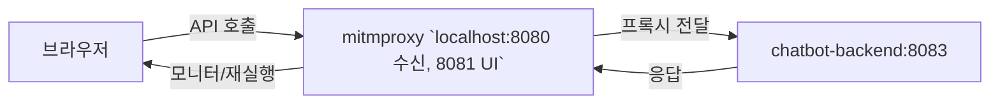

# clt-chatbot-system

제품화 전환을 위한 챗봇 시스템 설계/개발 레포지토리. 

## 구성 개요
- `chatbot-front`: reference/clt-chatbot 기반으로 개선
  - `http://localhost:10000`
  - `01.workspaces/apps/chatbot-front`
- `chatbot-backend`: 신규 개발 (FastAPI + PostgreSQL)
  - `http://localhost:8083/docs`
  - `01.workspaces/apps/chatbot-backend`
- `chatbot-admin`: reference/react-flow 기반으로 개선
  - `http://localhost:10001`
  - `01.workspaces/apps/chatbot-admin`
- `chatbot-admin-backend`: 신규 개발 (FastAPI + PostgreSQL)
  - `http://localhost:8082/docs`
  - `01.workspaces/apps/chatbot-admin-backend`

## Docker Compose (통합 실행)
- `cd 01.workspaces/infra`
- `docker compose up --build -d`
- `docker compose ps`
- 작업 종료: `docker compose down`
- 작업 종료(볼륨까지삭제): `docker compose down --volumes`

### 로그 보기
- `docker compose logs -f chatbot-backend`
- `docker compose logs --tail 200 -f chatbot-front chatbot-admin`
- 특정 서비스: `docker compose logs --timestamps --tail 100 <서비스명>`
- 문제가 최근 5분 이내에만 발생했으면 `docker compose logs --since 5m --no-color <서비스명>`

### 프록시 적용 

docker-compose.override.yml 설정에 의하여 chatbot-front와 chatbot-back사이에 proxy layer가 추가된다.

- `docker compose`는 `docker-compose.override.yml`도 읽어서 `chatbot-front`의 `API_BASE_URL`을 `http://localhost:8080`으로 덮어쓰며 mitmproxy를 앞단에 둠
- mitmproxy는 8080에서 수신한 요청을 내부 `chatbot-backend:8083`으로 전달한다
- 브라우저에서 `http://localhost:8081`을 열어 요청/응답 헤더·바디를 실시간으로 확인하고 필터/재실행 가능
- 프록시 로그가 필요하면 `docker compose logs -f mitmproxy`
- HTTPS를 가로채려면 mitmproxy CA 인증서를 설치하거나, 우선 HTTP로 테스트

## 운영체제별 Docker 개발 스크립트
- **Windows CMD**: `01.workspaces/infra/startup.cmd` (기본적으로 `NEXT_DEV_CMD=devnoturbo`, 필요시 `set NEXT_DEV_CMD=dev`)
- **Windows PowerShell**: `01.workspaces/infra/startup.ps1` (실행: `powershell -NoProfile -ExecutionPolicy Bypass ./01.workspaces/infra/startup.ps1`)
- **mac/Linux/WSL**: `01.workspaces/infra/docker-up.sh`

모든 스크립트는 `01.workspaces/infra` 폴더로 이동한 뒤 실행되며, 기본 `docker compose up --build`를 호출합니다. 추가 플래그를 그대로 넘기거나 `NEXT_DEV_CMD`를 덮어써서 turbopack(`devnoturbo`) <-> 표준 `next dev` 전환이 가능합니다.

## 프론트 단독 실행방법

프론트도 docker-compose에 같이 포함되어 구동됩니다만 따로 실행시키고 싶을 경우 아래와 같이 구동시킬 수 있습니다.

- chatbot-front
- chatbot-admin

## TODO
- 인증 제안
  - `00.documents/analysis/auth-login-proposal.md`

## 주의사항
- `reference/clt-chatbot`, `reference/react-flow`는 참고용이며 수정 금지
- 산출물은 `00.documents` 하위에 markdown으로 작성
